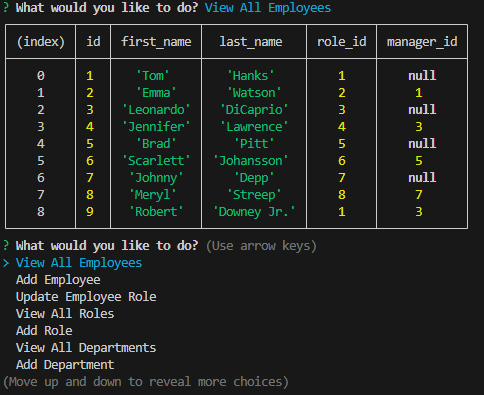

# sql-employee-tracker

## Description

The Employee Tracker CLI is a command-line application that allows users to manage departments, roles, and employees in a company. It provides functionality to view, add, and update information stored in a MySQL database.

## Features

* View all departments, roles, and employees.
* Add new departments, roles, and employees.
* Update an employee's role.

## Installation

1. Clone the repository to your local machine.
`git clone https://github.com/your-username/employee-tracker-cli.git`
2. Install dependencies.
`npm install`
3. Set up your MySQL database by running the provided `schema.sql` and `seeds.sql` files.
4. Create a `.env` file in the project root and configure your MySQL connection parameters.
```
DB_USER=your_username
DB_PASS=your_password
DB_NAME=employee_tracker_db
```


## Usage

1. Run the application using `npm start`
2. Follow the prompts to interact with the Employee Tracker CLI.
 


## Credits

Diarmuid Murphy (Instructor)

Meg Meyers (TA)